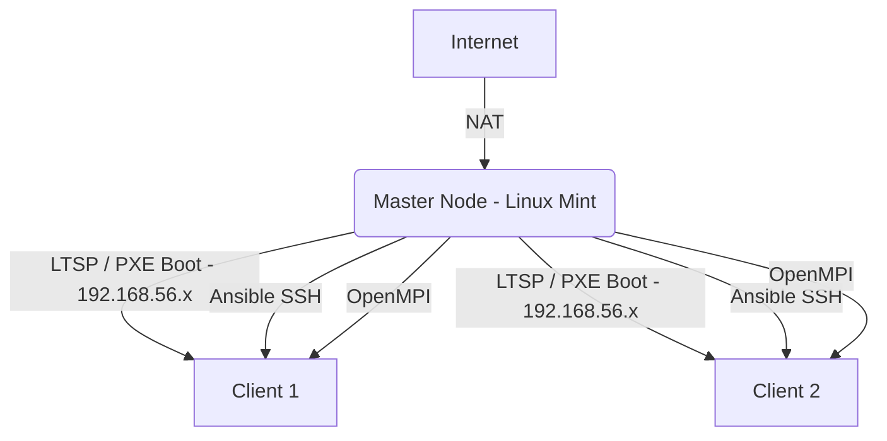

# Rapport Technique: Conception d'un Cluster MPI Hétérogène CPU avec LTSP et Ansible

## 1. Introduction
Ce projet vise à concevoir et déployer un cluster de calcul haute performance (HPC) hétérogène en utilisant Linux Terminal Server Project (LTSP) pour le démarrage en réseau, Ansible pour l'automatisation de la configuration, et OpenMPI pour l'exécution parallèle.

## 2. Architecture du Cluster
L'architecture repose sur une topologie de réseau interne gérée par LTSP:
- **Nœud Maître (Master):** Machine sous Linux Mint avec deux interfaces réseau (NAT pour l'accès Internet et Réseau Interne `192.168.56.x` pour le cluster). Il héberge le serveur DHCP/TFTP (dnsmasq), le playbook Ansible, et le code source OpenMPI.
- **Nœuds Esclaves (Clients):** Machines virtuelles (PC x86) sans disque dur qui démarrent via le réseau (PXE) en chargeant l'image générée par LTSP.



## 3. Mise en Place (Partie 1)
La mise en place a été réalisée en automatisant l'installation de `ltsp`, `dnsmasq`, et `openmpi-bin`.
1. **Réseau:** Configuration de l'IP statique du maître sur le réseau interne.
2. **LTSP:** Utilisation de `ltsp image /` pour compresser le système de fichiers racine du maître dans une image SquashFS.
3. **Boot:** Configuration de `dnsmasq` et `ltsp ipxe` pour servir l'image aux clients PXE.
4. **SSH:** Génération des clés RSA et ajout au fichier `authorized_keys` pour un accès sans mot de passe entre tous les nœuds (les clients héritent du `authorized_keys` du maître).

## 4. Automatisation (Partie 2)
L'automatisation est gérée par le playbook Ansible `setup_cluster.yml`.
Ce playbook:
- Lit le fichier `/var/lib/misc/dnsmasq.leases` pour identifier automatiquement les adresses IP des clients connectés.
- Génère le fichier `hostfile` pour OpenMPI de manière dynamique.
- Assure l'installation des dépendances OpenMPI (`openmpi-bin`, `libopenmpi-dev`).

## 5. Déploiement et Tests MPI (Partie 3 & 4)
Le test de bon fonctionnement s'est fait via le programme `mpi_test.c` (inclus dans le projet).
Pour compiler et exécuter sur tous les nœuds découverts par Ansible :
```bash
mpicc -o mpi_test mpi_test.c
mpirun --hostfile /home/slave/hostfile -np 4 ./mpi_test
```
Les mesures de performances (HPL / HPCG) peuvent maintenant être exécutées sur ce cluster opérationnel pour calculer le speedup et l'efficacité globale en fonction du nombre de cœurs alloués.

## 6. Conclusion
Cette architecture permet de transformer n'importe quel ensemble de machines connectées au réseau local en un cluster de calcul puissant et homogène (via l'image LTSP), tout en réduisant considérablement le temps d'administration grâce à Ansible.
