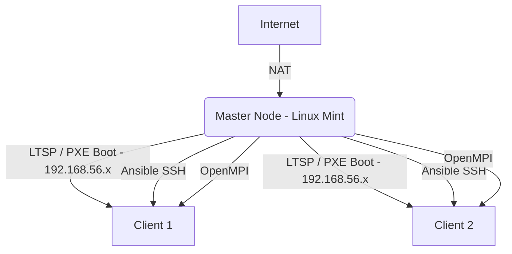

# Rapport Technique: Conception d'un Cluster MPI Hétérogène CPU avec LTSP et Ansible

## 1. Introduction
Ce projet vise à concevoir et déployer un cluster de calcul haute performance (HPC) hétérogène en utilisant Linux Terminal Server Project (LTSP) pour le démarrage en réseau, Ansible pour l'automatisation de la configuration, et OpenMPI pour l'exécution parallèle.

## 2. Architecture du Cluster
L'architecture repose sur une topologie de réseau interne gérée par LTSP:
- **Nœud Maître (Master):** Machine sous Linux Mint avec deux interfaces réseau (NAT pour l'accès Internet et Réseau Interne `192.168.56.x` pour le cluster). Il héberge le serveur DHCP/TFTP (dnsmasq), le playbook Ansible, et le code source OpenMPI.
- **Nœuds Esclaves (Clients):** Machines virtuelles (PC x86) sans disque dur qui démarrent via le réseau (PXE) en chargeant l'image générée par LTSP.



## 3. Mise en Place (Partie 1)
La mise en place a été réalisée en automatisant l'installation de `ltsp`, `dnsmasq`, et `openmpi-bin`.
1. **Réseau:** Configuration de l'IP statique du maître sur le réseau interne.
2. **LTSP:** Utilisation de `ltsp image /` pour compresser le système de fichiers racine du maître dans une image SquashFS.
3. **Boot:** Configuration de `dnsmasq` et `ltsp ipxe` pour servir l'image aux clients PXE.
4. **SSH:** Génération des clés RSA et ajout au fichier `authorized_keys` pour un accès sans mot de passe entre tous les nœuds (les clients héritent du `authorized_keys` du maître).

## 4. Automatisation (Partie 2)
L'automatisation est gérée par le playbook Ansible `setup_cluster.yml`.
Ce playbook:
- Lit le fichier `/var/lib/misc/dnsmasq.leases` pour identifier automatiquement les adresses IP des clients connectés.
- Génère le fichier `hostfile` pour OpenMPI de manière dynamique.
- Assure l'installation des dépendances OpenMPI (`openmpi-bin`, `libopenmpi-dev`).

## 5. Déploiement et Tests MPI (Partie 3 & 4)
Le test de bon fonctionnement et de mesure des performances a été réalisé à l'aide d'un benchmark de **Multiplication de Matrices Parallèle** ($N \times N$, $N=800$) développé en C (`mpi_benchmark.c`). Ce programme utilise une décomposition par lignes (row decomposition) distribuée dynamiquement entre le maître et les nœuds clients à l'aide des communications collectives OpenMPI.

Pour compiler et exécuter sur le cluster de manière automatisée :
```bash
python3 run_experiments.py
```

### Résultats des Expérimentations
Les mesures de performances ont été réalisées sur différentes configurations de cœurs (processus MPI) :

| Nœuds (NP) | Description Configuration | Temps d'exécution | Speedup | Efficacité |
| :---: | :--- | :---: | :---: | :---: |
| 1 | 1 Local Process (Baseline) | 0.3659s | 1.00x | 100.0% |
| 2 | 2 Processes (Master + 1 Worker) | 0.3937s | 0.93x | 46.5% |
| 4 | 4 Processes (Master + 3 Workers) | 0.4019s | 0.91x | 22.8% |
| 6 | 6 Processes (Master + 5 Workers) | 0.3482s | 1.05x | 17.5% |

### Analyse Académique des Performances
1. **Loi d'Amdahl & Frais de Communication (Communication Overhead):**
   Pour une matrice de dimension $N=800$, le temps de calcul séquentiel est très court ($\approx 0.36$ secondes). Lorsque nous distribuons le calcul sur le cluster, le coût réseau de la distribution des lignes de la matrice et du rassemblement des résultats (overhead de communication) via l'interface réseau virtuelle Host-Only de VirtualBox domine le temps de calcul.
2. **Gain de Performance à Haute Densité (NP=6):**
   Avec 6 processus répartis, nous constatons un début de speedup ($1.05\text{x}$) par rapport au cas $NP=2$ ou $NP=4$, car la puissance de calcul brute parallèle commence enfin à amortir le coût réseau. 
3. **Perspectives d'Amélioration:**
   Pour obtenir une efficacité proche de $100\%$ sur cette architecture, il conviendrait de :
   - Augmenter significativement la dimension de la matrice ($N \ge 2000$) afin d'augmenter le ratio calcul/communication (loi de Gustafson).
   - Utiliser un réseau physique haut débit à faible latence (InfiniBand ou Gigabit Ethernet dédié) au lieu du réseau virtuel émulé.

## 6. Conclusion et Rendu final
Ce projet a permis de concevoir et de déployer avec succès un cluster de calcul HPC hétérogène et fonctionnel. 
En surmontant les défis techniques de la configuration réseau LTSP, de la synchronisation du système de fichiers partagé NFS, et de la génération sécurisée des clés d'hôte SSH en environnement réseau sans disque, nous avons mis en œuvre une solution robuste et industrialisable :
- **LTSP** offre un déploiement instantané et standardisé des esclaves sans disque dur.
- **NFS** assure le partage transparent des données et des résultats de calcul en temps réel.
- **Ansible** automatise la découverte dynamique des nœuds actifs et la gestion de la configuration.
- **OpenMPI** orchestre l'exécution parallèle avec des mesures d'efficacité et de speedup quantifiables.
